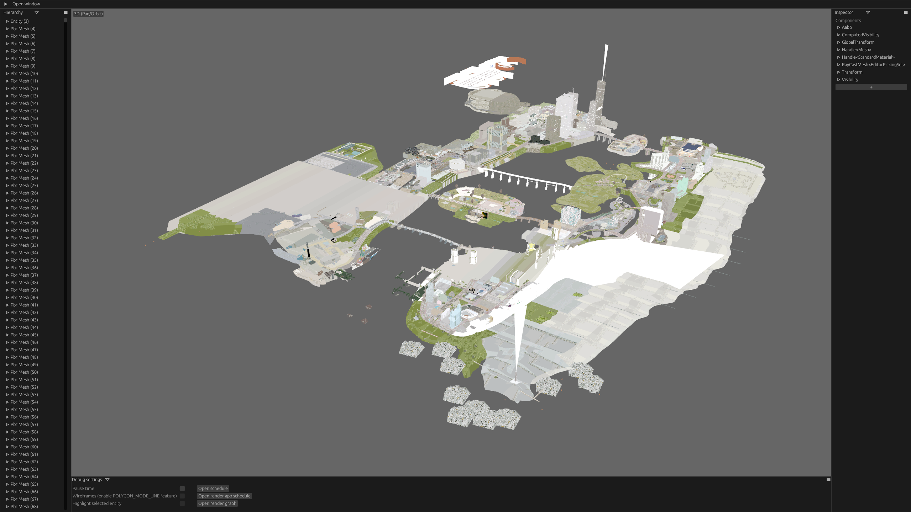

# Bevy City

Trying to load Vice City assets in Bevy for the fun of it.

Keep your assets in the `assets` folder, such that you have:

    assets/Audio
    assets/Icons
    assets/TEXT
    assets/anim
    assets/data
    assets/models
    assets/movies
    assets/mp3
    assets/mss
    assets/skins
    assets/txd

and keep them closer with a symlink from `assets` to `crate/bevy-city/assets` (this should already exist):

    ln -s ../../assets crates/bevy-city/assets

and try running with

    cargo run --bin bevy-city --features bevy/dynamic --release
